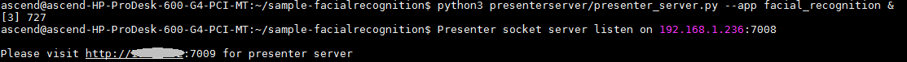
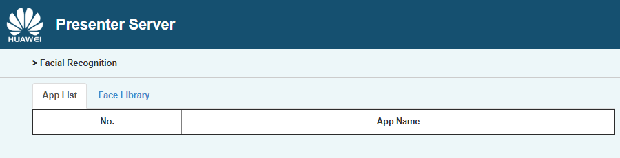
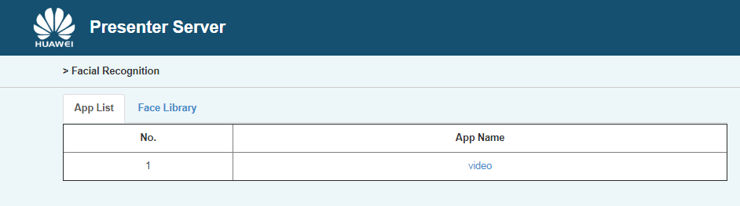

EN|[CN](README_cn.md)

Developers can deploy the application on the Atlas 200 DK to register a face, predict the face information in the video by using the camera, and compare the predicted face with the registered face to predict the most possible user.

## Prerequisites<a name="en-us_topic_0167333413_section412314183119"></a>

Before using an open source application, ensure that:

-   MindSpore Studio has been installed. For details, see  [MindSpore Studio Installation Guide](https://www.huawei.com/minisite/ascend/en/filedetail_1.html).
-   The Atlas 200 DK developer board has been connected to MindSpore Studio, the cross compiler has been installed, the SD card has been prepared, and basic information has been configured. For details, see  [Atlas 200 DK User Guide](https://www.huawei.com/minisite/ascend/en/filedetail_2.html).

## Software Preparation<a name="en-us_topic_0167333413_section431629175317"></a>

Before running the application, obtain the source code package and configure the environment as follows.

1.  Obtain the source code package.

    Download all the code in the sample-facialrecognition repository at  [https://github.com/Ascend/sample-facialrecognition](https://github.com/Ascend/sample-facialrecognition)  to any directory on Ubuntu Server where MindSpore Studio is located as the MindSpore Studio installation user, for example,  _/home/ascend/sample-facialrecognition_.

2.  Log in to Ubuntu Server where MindSpore Studio is located as the MindSpore Studio installation user and set the environment variable  **DDK\_HOME**.

    **vim \~/.bashrc**

    Run the following commands to add the environment variables  **DDK\_HOME**  and  **LD\_LIBRARY\_PATH**  to the last line:

    **export DDK\_HOME=/home/XXX/tools/che/ddk/ddk**

    **export LD\_LIBRARY\_PATH=$DDK\_HOME/uihost/lib**

    > **NOTE:**   
    >-   **XXX**  indicates the MindSpore Studio installation user, and  **/home/XXX/tools**  indicates the default installation path of the DDK.  
    >-   If the environment variables have been added, skip this step.  

    Enter  **:wq!**  to save and exit.

    Run the following command for the environment variable to take effect:

    **source \~/.bashrc**


## Deployment<a name="en-us_topic_0167333413_section1675513165418"></a>

1.  Access the root directory where the facial recognition application code is located as the MindSpore Studio installation user, for example,  **_/home/ascend/sample-facialrecognition_**.
2.  <a name="en-us_topic_0167333413_li08019112542"></a>Run the deployment script to prepare the project environment, including compiling and deploying the ascenddk public library, downloading the network model, and configuring Presenter Server.

    **bash deploy.sh** _host\_ip_ _model\_mode_

    -   _host\_ip_: this parameter indicates the IP address of the Atlas 200 DK developer board.

    -   _model\_mode_  indicates the deployment mode of the model file. The default setting is  **internet**.
        -   **local**: If the Ubuntu system where MindSpore Studio is located is not connected to the network, use the local mode. In this case, download the network model file and the dependent common code library  to the  **/sample-facialrecognition/script** directory, by referring to  [Downloading Network Models and Dependency Code Library](#en-us_topic_0167333413_section866041015517).
        -   **internet**: If the Ubuntu system where MindSpore Studio is located is connected to the network, use the Internet mode. In this case, download the model file and  dependency code library online.


    Example command:

    **bash deploy.sh 192.168.1.2 internet**

    -   When the message  **Please choose one to show the presenter in browser\(default: 127.0.0.1\):**  is displayed, enter the IP address used for accessing the Presenter Server service in the browser. Generally, the IP address is the IP address for accessing the MindSpore Studio service.
    -   When the message  **Please input a absolute path to storage facial recognition data:**  is displayed, enter the path for storing face registration data and parsing data in MindSpore Studio. The MindSpore Studio user must have the read and write permissions. If the path does not exist, the script will automatically create it.

    Select the IP address used by the browser to access the Presenter Server service in  **Current environment valid ip list**  and enter the path for storing facial recognition data, as shown in  [Figure 1](#en-us_topic_0167333413_fig184321447181017).

    **Figure  1**  Project deployment<a name="en-us_topic_0167333413_fig184321447181017"></a>  
    

3.  Start Presenter Server.

    Run the following command to start the Presenter Server program of the facial recognition application in the background:

    **python3 presenterserver/presenter\_server.py --app facial\_recognition &**

    > **NOTE:**   
    >**presenter\_server.py**  is located in the  **presenterserver**  directory. You can run the  **python3 presenter\_server.py -h**  or  **python3 presenter\_server.py --help**  command in this directory to view the usage method of  **presenter\_server.py**.  

    [Figure 2](#en-us_topic_0167333413_fig69531305324)  shows that the presenter\_server service is started successfully.

    **Figure  2**  Starting the Presenter Server process<a name="en-us_topic_0167333413_fig69531305324"></a>  
    

    Use the URL shown in the preceding figure to log in to Presenter Server \(only the Chrome browser is supported\). The IP address is that entered in  [2](#en-us_topic_0167333413_li08019112542)  and the default port number is  **7009**. The following figure indicates that Presenter Server is started successfully.

    **Figure  3**  Home page<a name="en-us_topic_0167333413_fig64391558352"></a>  
    


## Running<a name="en-us_topic_0167333413_section833124235913"></a>

1.  Run the facial recognition application.

    Run the following command in the  **sample-facialrecognition**  directory to start the facial recognition application:

    **bash run\_facialrecognitionapp.sh** _host\_ip_ _presenter\_view\_app\_name camera\_channel\_name_  &

    -   _host\_ip_: For the Atlas 200 DK developer board, this parameter indicates the IP address of the developer board.
    -   _presenter\_view\_app\_name_: Indicates  **App Name**  displayed on the Presenter Server page, which is user-defined.
    -   _camera\_channel\_name_: Indicates the channel to which a camera belongs. The value can be  **Channel-1**  or  **Channel-2**. For details, see  **Common Operations > View the Channel to Which a Camera Belongs** of [Atlas 200 DK User Guide](https://www.huawei.com/minisite/ascend/en/filedetail_2.html).
    
    Example command:

    **bash run\_facialrecognitionapp.sh 192.168.1.2 video Channel-1 &**

2.  Use the URL that is displayed when you start the Presenter Server service to log in to the Presenter Server website \(only the Chrome browser is supported\).

    [Figure 4](#en-us_topic_0167333413_fig1189774382115)  shows the Presenter Server page.

    **Figure  4**  Presenter Server page<a name="en-us_topic_0167333413_fig1189774382115"></a>  
    

    > **NOTE:**   
    >-   The Presenter Server of the facial recognition application supports a maximum of two channels at the same time , each  _presenter\_view\_app\_name_  corresponds to a channel.  
    >-   Due to hardware limitations, the maximum frame rate supported by each channel is 20fps,  a lower frame rate is automatically used when the network bandwidth is low.  

3.  Register a face.
    1.  Click the  **Face Library**  tab and enter a user name in the  **Username**  text box.

        

    2.  Click  **Browse**  to upload a face image. Crop the face image based on the ratio of  **Example Photo**.

    1.  Click  **Submit**. If the upload fails, you can change the cropping ratio.

4.  Perform facial recognition and comparison.

    On the  **App List**  tab page, click  _video_  for example in the  **App Name**  column. If a face is displayed in the camera and matches the registered face, the name and similarity information of the person are displayed.


## Follow-up Operations<a name="en-us_topic_0167333413_section1092612277429"></a>

-   **Stopping the Facial Recognition Application**

    The facial recognition application is running continuously after being executed. To stop it, perform the following operation:

    Run the following command in the  **sample-facialrecognition**  directory as the MindSpore Studio installation user:

    **bash stop\_facialrecognitionapp.sh** _host\_ip_

    _host\_ip_: For the Atlas 200 DK developer board, this parameter indicates the IP address of the developer board.

    Example command:

    **bash stop\_facialrecognitionapp.sh 192.168.1.2**

-   **Stopping the Presenter Server Service**

    The Presenter Server service is always in the running state after being started. To stop the Presenter Server service of the facial recognition application, perform the following operations:

    Run the following command to check the process of the Presenter Server service corresponding to the facial recognition application as the MindSpore Studio installation user:

    **ps -ef | grep presenter | grep facial\_recognition**

    ```
    ascend@ascend-HP-ProDesk-600-G4-PCI-MT:~/sample-facialrecognition$ ps -ef | grep presenter | grep facial_recognition
    ascend 22294 20313 22 14:45 pts/24?? 00:00:01 python3 presenterserver/presenter_server.py --app facial_recognition
    ```

    In the preceding information,  _22294_  indicates the process ID of the Presenter Server service corresponding to the facial recognition application.

    To stop the service, run the following command:

    **kill -9** _22294_


## Downloading Network Models and Dependency Code Library<a name="en-us_topic_0167333413_section866041015517"></a>

-   Downloading network models

    The models used in the Facial Recognition application are converted models that adapt to the Ascend 310 chipset. For details about how to download this kind of models and the original network models, see  [Table 1](#en-us_topic_0167333413_table0531392153). If you have a better model solution, you are welcome to share it at  [https://github.com/Ascend/models](https://github.com/Ascend/models).

    Download the network models files (.om files) to the **sample-facialrecognition/script** directory.

    **Table  1**  Models used in Atlas DK open source applications

    <a name="en-us_topic_0167333413_table0531392153"></a>
    <table><thead align="left"><tr id="en-us_topic_0167333413_row1154103991514"><th class="cellrowborder" valign="top" width="15.841584158415841%" id="mcps1.2.5.1.1"><p id="en-us_topic_0167333413_p195418397155"><a name="en-us_topic_0167333413_p195418397155"></a><a name="en-us_topic_0167333413_p195418397155"></a>Model Name</p>
    </th>
    <th class="cellrowborder" valign="top" width="21.782178217821784%" id="mcps1.2.5.1.2"><p id="en-us_topic_0167333413_p1054539151519"><a name="en-us_topic_0167333413_p1054539151519"></a><a name="en-us_topic_0167333413_p1054539151519"></a>Description</p>
    </th>
    <th class="cellrowborder" valign="top" width="28.71287128712871%" id="mcps1.2.5.1.3"><p id="en-us_topic_0167333413_p387083117108"><a name="en-us_topic_0167333413_p387083117108"></a><a name="en-us_topic_0167333413_p387083117108"></a>Model Download Path</p>
    </th>
    <th class="cellrowborder" valign="top" width="33.663366336633665%" id="mcps1.2.5.1.4"><p id="en-us_topic_0167333413_p35412397154"><a name="en-us_topic_0167333413_p35412397154"></a><a name="en-us_topic_0167333413_p35412397154"></a>Original Network Download Address</p>
    </th>
    </tr>
    </thead>
    <tbody><tr id="en-us_topic_0167333413_row65414393159"><td class="cellrowborder" valign="top" width="15.841584158415841%" headers="mcps1.2.5.1.1 "><p id="en-us_topic_0167333413_p17544398153"><a name="en-us_topic_0167333413_p17544398153"></a><a name="en-us_topic_0167333413_p17544398153"></a>Network model for face detection</p>
    <p id="en-us_topic_0167333413_p84114461512"><a name="en-us_topic_0167333413_p84114461512"></a><a name="en-us_topic_0167333413_p84114461512"></a>(<strong id="en-us_topic_0167333413_b41111030191911"><a name="en-us_topic_0167333413_b41111030191911"></a><a name="en-us_topic_0167333413_b41111030191911"></a>face_detection.om</strong>)</p>
    </td>
    <td class="cellrowborder" valign="top" width="21.782178217821784%" headers="mcps1.2.5.1.2 "><p id="en-us_topic_0167333413_p169011731015"><a name="en-us_topic_0167333413_p169011731015"></a><a name="en-us_topic_0167333413_p169011731015"></a>This model is used in the <strong id="en-us_topic_0167333413_b1076142319547"><a name="en-us_topic_0167333413_b1076142319547"></a><a name="en-us_topic_0167333413_b1076142319547"></a>facial recognition </strong>applications.</p>
    <p id="en-us_topic_0167333413_p1372429181516"><a name="en-us_topic_0167333413_p1372429181516"></a><a name="en-us_topic_0167333413_p1372429181516"></a>It is a network model converted from ResNet0-SSD300 model based on Caffe.</p>
    </td>
    <td class="cellrowborder" valign="top" width="28.71287128712871%" headers="mcps1.2.5.1.3 "><p id="en-us_topic_0167333413_p1569513572242"><a name="en-us_topic_0167333413_p1569513572242"></a><a name="en-us_topic_0167333413_p1569513572242"></a>Download the model from the <strong id="en-us_topic_0167333413_b028612482311"><a name="en-us_topic_0167333413_b028612482311"></a><a name="en-us_topic_0167333413_b028612482311"></a>computer_vision/object_detect/face_detection</strong> directory in the <a href="https://github.com/Ascend/models/" target="_blank" rel="noopener noreferrer">https://github.com/Ascend/models/</a> repository.</p>
    <p id="en-us_topic_0167333413_p1787118315101"><a name="en-us_topic_0167333413_p1787118315101"></a><a name="en-us_topic_0167333413_p1787118315101"></a>For the version description, see the <strong id="en-us_topic_0167333413_b1012219832511"><a name="en-us_topic_0167333413_b1012219832511"></a><a name="en-us_topic_0167333413_b1012219832511"></a>README.md</strong> file in the current directory.</p>
    </td>
    <td class="cellrowborder" valign="top" width="33.663366336633665%" headers="mcps1.2.5.1.4 "><p id="en-us_topic_0167333413_p1785381617217"><a name="en-us_topic_0167333413_p1785381617217"></a><a name="en-us_topic_0167333413_p1785381617217"></a>For details, see the <strong id="en-us_topic_0167333413_b1423252411265"><a name="en-us_topic_0167333413_b1423252411265"></a><a name="en-us_topic_0167333413_b1423252411265"></a>README.md</strong> file of the <strong id="en-us_topic_0167333413_b688544332614"><a name="en-us_topic_0167333413_b688544332614"></a><a name="en-us_topic_0167333413_b688544332614"></a>computer_vision/object_detect/face_detection</strong> directory in the <a href="https://github.com/Ascend/models/" target="_blank" rel="noopener noreferrer">https://github.com/Ascend/models/</a> repository.</p>
    <p id="en-us_topic_0167333413_p1314312124919"><a name="en-us_topic_0167333413_p1314312124919"></a><a name="en-us_topic_0167333413_p1314312124919"></a><strong id="en-us_topic_0167333413_b1365251225519"><a name="en-us_topic_0167333413_b1365251225519"></a><a name="en-us_topic_0167333413_b1365251225519"></a>Precautions during model conversion:</strong></p>
    <p id="en-us_topic_0167333413_p53116302463"><a name="en-us_topic_0167333413_p53116302463"></a><a name="en-us_topic_0167333413_p53116302463"></a>During the conversion, a message is displayed indicating that the conversion fails. You only need to select <strong id="en-us_topic_0167333413_b55978299556"><a name="en-us_topic_0167333413_b55978299556"></a><a name="en-us_topic_0167333413_b55978299556"></a>SSDDetectionOutput </strong>from the drop-down list box for the last layer and click <strong id="en-us_topic_0167333413_b15597182918551"><a name="en-us_topic_0167333413_b15597182918551"></a><a name="en-us_topic_0167333413_b15597182918551"></a>Retry</strong>.</p>
    <p id="en-us_topic_0167333413_p109405475158"><a name="en-us_topic_0167333413_p109405475158"></a><a name="en-us_topic_0167333413_p109405475158"></a><a name="en-us_topic_0167333413_image13957135893610"></a><a name="en-us_topic_0167333413_image13957135893610"></a><span></span></p>
    <p id="en-us_topic_0167333413_p179225194910"><a name="en-us_topic_0167333413_p179225194910"></a><a name="en-us_topic_0167333413_p179225194910"></a></p>
    </td>
    </tr>
    <tr id="en-us_topic_0167333413_row155415393152"><td class="cellrowborder" valign="top" width="15.841584158415841%" headers="mcps1.2.5.1.1 "><p id="en-us_topic_0167333413_p6990631102413"><a name="en-us_topic_0167333413_p6990631102413"></a><a name="en-us_topic_0167333413_p6990631102413"></a>Network model for marking facial feature points</p>
    <p id="en-us_topic_0167333413_p454183941513"><a name="en-us_topic_0167333413_p454183941513"></a><a name="en-us_topic_0167333413_p454183941513"></a>(<strong id="en-us_topic_0167333413_b12463172516297"><a name="en-us_topic_0167333413_b12463172516297"></a><a name="en-us_topic_0167333413_b12463172516297"></a>vanillacnn.om</strong>)</p>
    </td>
    <td class="cellrowborder" valign="top" width="21.782178217821784%" headers="mcps1.2.5.1.2 "><p id="en-us_topic_0167333413_p1575814477201"><a name="en-us_topic_0167333413_p1575814477201"></a><a name="en-us_topic_0167333413_p1575814477201"></a>This model is used in the <strong id="en-us_topic_0167333413_b19216355548"><a name="en-us_topic_0167333413_b19216355548"></a><a name="en-us_topic_0167333413_b19216355548"></a>facial recognition</strong> application.</p>
    <p id="en-us_topic_0167333413_p155463921512"><a name="en-us_topic_0167333413_p155463921512"></a><a name="en-us_topic_0167333413_p155463921512"></a>It is a network model converted from the VanillaCNN model based on Caffe.</p>
    </td>
    <td class="cellrowborder" valign="top" width="28.71287128712871%" headers="mcps1.2.5.1.3 "><p id="en-us_topic_0167333413_p1824716215252"><a name="en-us_topic_0167333413_p1824716215252"></a><a name="en-us_topic_0167333413_p1824716215252"></a>Download the model from the <strong id="en-us_topic_0167333413_b6158123118309"><a name="en-us_topic_0167333413_b6158123118309"></a><a name="en-us_topic_0167333413_b6158123118309"></a>computer_vision/classification/vanillacnn</strong> directory in the <a href="https://github.com/Ascend/models/" target="_blank" rel="noopener noreferrer">https://github.com/Ascend/models/</a> repository.</p>
    <p id="en-us_topic_0167333413_p687113311100"><a name="en-us_topic_0167333413_p687113311100"></a><a name="en-us_topic_0167333413_p687113311100"></a>For the version description, see the <strong id="en-us_topic_0167333413_b147611343143916"><a name="en-us_topic_0167333413_b147611343143916"></a><a name="en-us_topic_0167333413_b147611343143916"></a>README.md</strong> file in the current directory.</p>
    </td>
    <td class="cellrowborder" valign="top" width="33.663366336633665%" headers="mcps1.2.5.1.4 "><p id="en-us_topic_0167333413_p19436133072511"><a name="en-us_topic_0167333413_p19436133072511"></a><a name="en-us_topic_0167333413_p19436133072511"></a>For details, see the <strong id="en-us_topic_0167333413_b118461052203014"><a name="en-us_topic_0167333413_b118461052203014"></a><a name="en-us_topic_0167333413_b118461052203014"></a>README.md</strong> file of the <strong id="en-us_topic_0167333413_b10846852123017"><a name="en-us_topic_0167333413_b10846852123017"></a><a name="en-us_topic_0167333413_b10846852123017"></a>computer_vision/classification/vanillacnn</strong> directory in the <a href="https://github.com/Ascend/models/" target="_blank" rel="noopener noreferrer">https://github.com/Ascend/models/</a> repository.</p>
    <p id="en-us_topic_0167333413_p425615467495"><a name="en-us_topic_0167333413_p425615467495"></a><a name="en-us_topic_0167333413_p425615467495"></a><strong id="en-us_topic_0167333413_b6231105355518"><a name="en-us_topic_0167333413_b6231105355518"></a><a name="en-us_topic_0167333413_b6231105355518"></a>Precautions during model conversion:</strong></p>
    <p id="en-us_topic_0167333413_p1158655911427"><a name="en-us_topic_0167333413_p1158655911427"></a><a name="en-us_topic_0167333413_p1158655911427"></a>For details about the configuration during conversion, see <a href="#en-us_topic_0167333413_fig1313163519454">Figure 5</a>.</p>
    <p id="en-us_topic_0167333413_p4282135274918"><a name="en-us_topic_0167333413_p4282135274918"></a><a name="en-us_topic_0167333413_p4282135274918"></a></p>
    </td>
    </tr>
    <tr id="en-us_topic_0167333413_row1754113961519"><td class="cellrowborder" valign="top" width="15.841584158415841%" headers="mcps1.2.5.1.1 "><p id="en-us_topic_0167333413_p182321181268"><a name="en-us_topic_0167333413_p182321181268"></a><a name="en-us_topic_0167333413_p182321181268"></a>Network model for obtaining feature vectors</p>
    <p id="en-us_topic_0167333413_p13543392156"><a name="en-us_topic_0167333413_p13543392156"></a><a name="en-us_topic_0167333413_p13543392156"></a>(<strong id="en-us_topic_0167333413_b471753818318"><a name="en-us_topic_0167333413_b471753818318"></a><a name="en-us_topic_0167333413_b471753818318"></a>sphereface.om</strong>)</p>
    </td>
    <td class="cellrowborder" valign="top" width="21.782178217821784%" headers="mcps1.2.5.1.2 "><p id="en-us_topic_0167333413_p79011151192613"><a name="en-us_topic_0167333413_p79011151192613"></a><a name="en-us_topic_0167333413_p79011151192613"></a>This model is used in the <strong id="en-us_topic_0167333413_b141681245155410"><a name="en-us_topic_0167333413_b141681245155410"></a><a name="en-us_topic_0167333413_b141681245155410"></a>facial recognition</strong> application.</p>
    <p id="en-us_topic_0167333413_p555239201512"><a name="en-us_topic_0167333413_p555239201512"></a><a name="en-us_topic_0167333413_p555239201512"></a>It is a network model converted from the SphereFace model based on Caffe.</p>
    </td>
    <td class="cellrowborder" valign="top" width="28.71287128712871%" headers="mcps1.2.5.1.3 "><p id="en-us_topic_0167333413_p24475542367"><a name="en-us_topic_0167333413_p24475542367"></a><a name="en-us_topic_0167333413_p24475542367"></a>Download the model from the <strong id="en-us_topic_0167333413_b1535211223323"><a name="en-us_topic_0167333413_b1535211223323"></a><a name="en-us_topic_0167333413_b1535211223323"></a>computer_vision/classification/sphereface</strong> directory in the <a href="https://github.com/Ascend/models/" target="_blank" rel="noopener noreferrer">https://github.com/Ascend/models/</a> repository.</p>
    <p id="en-us_topic_0167333413_p1844795416364"><a name="en-us_topic_0167333413_p1844795416364"></a><a name="en-us_topic_0167333413_p1844795416364"></a>For the version description, see the <strong id="en-us_topic_0167333413_b131206599398"><a name="en-us_topic_0167333413_b131206599398"></a><a name="en-us_topic_0167333413_b131206599398"></a>README.md</strong> file in the current directory.</p>
    </td>
    <td class="cellrowborder" valign="top" width="33.663366336633665%" headers="mcps1.2.5.1.4 "><p id="en-us_topic_0167333413_p19886417533"><a name="en-us_topic_0167333413_p19886417533"></a><a name="en-us_topic_0167333413_p19886417533"></a>For details, see the <strong id="en-us_topic_0167333413_b230513392323"><a name="en-us_topic_0167333413_b230513392323"></a><a name="en-us_topic_0167333413_b230513392323"></a>README.md</strong> file of the <strong id="en-us_topic_0167333413_b17307339163215"><a name="en-us_topic_0167333413_b17307339163215"></a><a name="en-us_topic_0167333413_b17307339163215"></a>computer_vision/classification/sphereface</strong> directory in the <a href="https://github.com/Ascend/models/" target="_blank" rel="noopener noreferrer">https://github.com/Ascend/models/</a> repository.</p>
    <p id="en-us_topic_0167333413_p3733107105018"><a name="en-us_topic_0167333413_p3733107105018"></a><a name="en-us_topic_0167333413_p3733107105018"></a><strong id="en-us_topic_0167333413_b17276105535516"><a name="en-us_topic_0167333413_b17276105535516"></a><a name="en-us_topic_0167333413_b17276105535516"></a>Precautions during model conversion:</strong></p>
    <p id="en-us_topic_0167333413_p5400191395016"><a name="en-us_topic_0167333413_p5400191395016"></a><a name="en-us_topic_0167333413_p5400191395016"></a>For details about the configuration during conversion, see <a href="#en-us_topic_0167333413_fig9653152612439">Figure 6</a>.</p>
    </td>
    </tr>
    </tbody>
    </table>

    **Figure  5**  Configuration for the VanillaCNN model during conversion<a name="en-us_topic_0167333413_fig1313163519454"></a>  
    

    -   **Input Shape**: The value of  **N**  is  **4**, indicating that four images are processed each time. The value of this parameter must be the same as the value of  **batch\_size**  in the corresponding model in the  **graph.config**  file.
    -   **Input Image Preprocess**: Set this parameter to  **Off**.

    **Figure  6**  Configuration for the Sphereface model during conversion<a name="en-us_topic_0167333413_fig9653152612439"></a>  
    

    -   **Input Shape**: The value of  **N**  is  **8**, indicating that eight images are processed each time. The value of this parameter must be the same as the value of  **batch\_size**  in the corresponding model in the  **graph.config**  file.
    -   **Input Image Format**: Enter the image format. In this example, this parameter is set to** RGB888\_U8**.
    -   **Input Image Size\[W|H\]**: Since the format of the input image is RGB8888\_U8, 128 x 16 alignment is not required. Use the width and height required by the model, that is,  **96**  and  **112**, respectively.
    -   **Mean Less\[B|G|R\]**: Indicates the mean value of the image used in the model training. The value can be obtained from the  **sphereface\_model.prototxt**  file of the model.
    -   **Multiplying Factor\[B|G|R\]**: Indicates the multiply coefficient of the image used in this model training. The value can be obtained from the** sphereface\_model.prototxt**  file of the model \(that is, the value of  **scale**\).

-   Download the dependent software libraries
    
     Download the dependent software libraries to the **sample-facialrecognition/script** directory.

    **Table  2**  Download the dependent software libraries

    <a name="en-us_topic_0167333413_table141761431143110"></a>
    <table><thead align="left"><tr id="en-us_topic_0167333413_row18177103183119"><th class="cellrowborder" valign="top" width="33.33333333333333%" id="mcps1.2.4.1.1"><p id="en-us_topic_0167333413_p8177331103112"><a name="en-us_topic_0167333413_p8177331103112"></a><a name="en-us_topic_0167333413_p8177331103112"></a>Module Name</p>
    </th>
    <th class="cellrowborder" valign="top" width="33.33333333333333%" id="mcps1.2.4.1.2"><p id="en-us_topic_0167333413_p1317753119313"><a name="en-us_topic_0167333413_p1317753119313"></a><a name="en-us_topic_0167333413_p1317753119313"></a>Module Description</p>
    </th>
    <th class="cellrowborder" valign="top" width="33.33333333333333%" id="mcps1.2.4.1.3"><p id="en-us_topic_0167333413_p1417713111311"><a name="en-us_topic_0167333413_p1417713111311"></a><a name="en-us_topic_0167333413_p1417713111311"></a>Download Address</p>
    </th>
    </tr>
    </thead>
    <tbody><tr id="en-us_topic_0167333413_row19177133163116"><td class="cellrowborder" valign="top" width="33.33333333333333%" headers="mcps1.2.4.1.1 "><p id="en-us_topic_0167333413_p2017743119318"><a name="en-us_topic_0167333413_p2017743119318"></a><a name="en-us_topic_0167333413_p2017743119318"></a>EZDVPP</p>
    </td>
    <td class="cellrowborder" valign="top" width="33.33333333333333%" headers="mcps1.2.4.1.2 "><p id="en-us_topic_0167333413_p52110611584"><a name="en-us_topic_0167333413_p52110611584"></a><a name="en-us_topic_0167333413_p52110611584"></a>Encapsulates the dvpp interface and provides image and video processing capabilities, such as color gamut conversion and image / video conversion</p>
    </td>
    <td class="cellrowborder" valign="top" width="33.33333333333333%" headers="mcps1.2.4.1.3 "><p id="en-us_topic_0167333413_p31774315318"><a name="en-us_topic_0167333413_p31774315318"></a><a name="en-us_topic_0167333413_p31774315318"></a><a href="https://github.com/Ascend/sdk-ezdvpp" target="_blank" rel="noopener noreferrer">https://github.com/Ascend/sdk-ezdvpp</a></p>
    <p id="en-us_topic_0167333413_p1634523015710"><a name="en-us_topic_0167333413_p1634523015710"></a><a name="en-us_topic_0167333413_p1634523015710"></a>After the download, keep the folder name <span class="filepath" id="en-us_topic_0167333413_filepath1324864613582"><a name="en-us_topic_0167333413_filepath1324864613582"></a><a name="en-us_topic_0167333413_filepath1324864613582"></a><b>ezdvpp</b></span>。</p>
    </td>
    </tr>
    <tr id="en-us_topic_0167333413_row101773315313"><td class="cellrowborder" valign="top" width="33.33333333333333%" headers="mcps1.2.4.1.1 "><p id="en-us_topic_0167333413_p217773153110"><a name="en-us_topic_0167333413_p217773153110"></a><a name="en-us_topic_0167333413_p217773153110"></a>Presenter Agent</p>
    </td>
    <td class="cellrowborder" valign="top" width="33.33333333333333%" headers="mcps1.2.4.1.2 "><p id="en-us_topic_0167333413_p19431399359"><a name="en-us_topic_0167333413_p19431399359"></a><a name="en-us_topic_0167333413_p19431399359"></a><span>API for interacting with the Presenter Server</span>.</p>
    </td>
    <td class="cellrowborder" valign="top" width="33.33333333333333%" headers="mcps1.2.4.1.3 "><p id="en-us_topic_0167333413_p16684144715560"><a name="en-us_topic_0167333413_p16684144715560"></a><a name="en-us_topic_0167333413_p16684144715560"></a><a href="https://github.com/Ascend/sdk-presenter/tree/master/presenteragent" target="_blank" rel="noopener noreferrer">https://github.com/Ascend/sdk-presenter/tree/master/presenteragent</a></p>
    <p id="en-us_topic_0167333413_p82315442578"><a name="en-us_topic_0167333413_p82315442578"></a><a name="en-us_topic_0167333413_p82315442578"></a>After the download, keep the folder name <span class="filepath" id="en-us_topic_0167333413_filepath19800155745817"><a name="en-us_topic_0167333413_filepath19800155745817"></a><a name="en-us_topic_0167333413_filepath19800155745817"></a><b>presenteragent</b></span>.</p>
    </td>
    </tr>
    <tr id="en-us_topic_0167333650_row101773315313"><td class="cellrowborder" valign="top" width="33.33333333333333%" headers="mcps1.2.4.1.1 "><p>tornado (5.1.0)</p><p>protobuf (3.5.1)</p><p>numpy (1.14.2)</P>
</td>
<td class="cellrowborder" valign="top" width="33.33333333333333%" headers="mcps1.2.4.1.2 "><p id="en-us_topic_0167333650_p19431399359"><a name="en-us_topic_0167333650_p19431399359"></a><a name="en-us_topic_0167333650_p19431399359"></a><span>Python libraries that Presenter Server depends on.</span>.</p>
</td>
<td class="cellrowborder" valign="top" width="33.33333333333333%" headers="mcps1.2.4.1.3 "><p id="en-us_topic_0167333650_p16684144715560">Search for related sources and install them.</p>
</td>
</tr>
    </tbody>
    </table>


