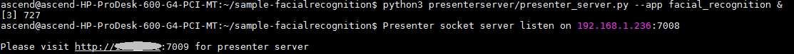
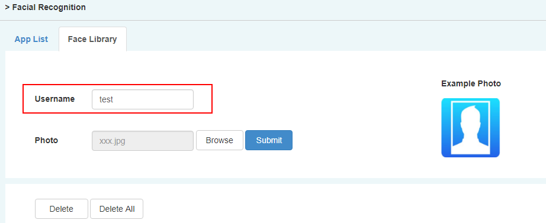
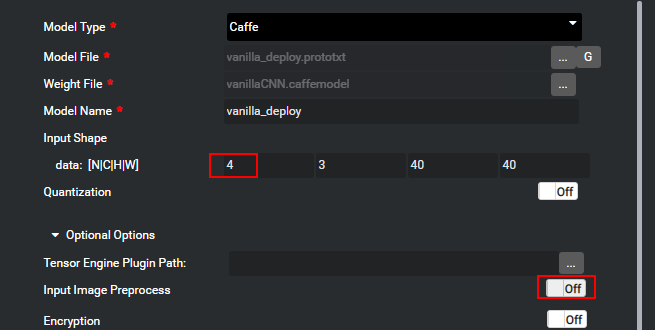
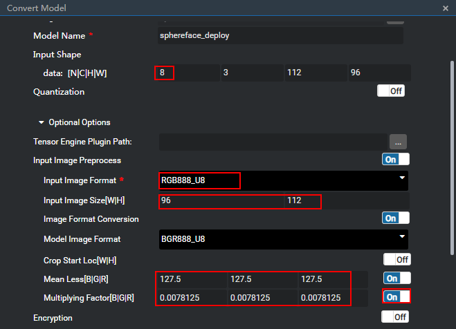

中文|[英文](README.md)

开发者可以将本Application部署至Atlas 200 DK上实现人脸注册、并通过摄像头对视频中的人脸信息进行预测，与已注册的人脸进行比对，预测出最可能的用户。

## 前提条件<a name="zh-cn_topic_0167217669_section137245294533"></a>

部署此Sample前，需要准备好以下环境：

-   已完成MindSpore Studio的安装，详细请参考[MindSpore Studio安装指南](https://www.huawei.com/minisite/ascend/cn/filedetail_1.html)。
-   已完成Atlas 200 DK开发者板与MindSpore Studio的连接，交叉编译器的安装，SD卡的制作及基本信息的配置等，详细请参考[Atlas 200 DK使用指南](https://www.huawei.com/minisite/ascend/cn/filedetail_2.html)。

## 软件准备<a name="zh-cn_topic_0167217669_section8534138124114"></a>

运行此Sample前，需要按照此章节获取源码包，并进行相关的环境配置。

1.  获取源码包。

    将[https://github.com/Ascend/sample-facialrecognition](https://github.com/Ascend/sample-facialrecognition)仓中的代码以MindSpore Studio安装用户下载至MindSpore Studio所在Ubuntu服务器的任意目录，例如代码存放路径为：/home/ascend/sample-facialrecognition。

2.  以MindSpore Studio安装用户登录MindSpore Studio所在Ubuntu服务器，并设置环境变量DDK\_HOME。

    **vim \~/.bashrc**

    执行如下命令在最后一行添加DDK\_HOME及LD\_LIBRARY\_PATH的环境变量。

    **export DDK\_HOME=/home/XXX/tools/che/ddk/ddk**

    **export LD\_LIBRARY\_PATH=$DDK\_HOME/uihost/lib**

    > **说明：**   
    >-   XXX为MindSpore Studio安装用户，/home/XXX/tools为DDK默认安装路径。  
    >-   如果此环境变量已经添加，则此步骤可跳过。  

    输入:wq!保存退出。

    执行如下命令使环境变量生效。

    **source \~/.bashrc**


## 部署<a name="zh-cn_topic_0167217669_section147911829155918"></a>

1.  以MindSpore Studio安装用户进入facialrecognition应用代码所在根目录，如_**/home/ascend/sample-facialrecognition**_。
2.  <a name="zh-cn_topic_0167217669_li08019112542"></a>执行部署脚本，进行工程环境准备，包括ascenddk公共库的编译与部署、网络模型的下载、Presenter Server服务器的配置等操作。

    **bash deploy.sh** _host\_ip_ _model\_mode_

    -   _host\_ip_：Atlas 200 DK开发者板的IP地址。

    -   model\_mode代表模型文件及依赖软件的部署方式，默认为internet。
        -   local：若MindSpore Studio所在Ubuntu系统未连接网络，请使用local模式，执行此命令前，需要参考[网络模型及公共代码库下载](#zh-cn_topic_0167217669_section158977311307)将网络模型文件以及依赖的代码库下载到“/sample-facialrecognition/script“目录下。
        -   internet：若MindSpore Studio所在Ubuntu系统已连接网络，请使用internet模式，在线下载模型文件及依赖代码库。


    命令示例：

    **bash deploy.sh 192.168.1.2 internet**

    -   当提示“Please choose one to show the presenter in browser\(default: 127.0.0.1\):“时，请输入在浏览器中访问Presenter Server服务所使用的IP地址（一般为访问MindSpore Studio的IP地址）。
    -   当提示“Please input a absolute path to storage facial recognition data:“时，请输入MindSpore Studio中存储人脸注册数据及解析数据，此路径MindSpore Studio用户需要有读写权限，如果此路径不存在，脚本会自动创建。

    如[图1](#zh-cn_topic_0167217669_fig184321447181017)所示，请在“Current environment valid ip list“中选择通过浏览器访问Presenter Server服务使用的IP地址，并输入存储人脸识别解析数据的路径。

    **图 1**  工程部署示意图<a name="zh-cn_topic_0167217669_fig184321447181017"></a>  
    

3.  启动Presenter Server。

    执行如下命令在后台启动Facial Recognition应用的Presenter Server主程序。

    **python3 presenterserver/presenter\_server.py --app facial\_recognition &**

    > **说明：**   
    >“presenter\_server.py“在当前目录的“presenterserver“目录下，可以在此目录下执行**python3 presenter\_server.py -h**或者**python3 presenter\_server.py --help**查看“presenter\_server.py“的使用方法。  

    如[图2](#zh-cn_topic_0167217669_fig69531305324)所示，表示presenter\_server的服务启动成功。

    **图 2**  Presenter Server进程启动<a name="zh-cn_topic_0167217669_fig69531305324"></a>  
    

    使用上图提示的URL登录Presenter Server，仅支持Chrome浏览器。IP地址为[2](#zh-cn_topic_0167217669_li08019112542)中输入的IP地址，端口号默为7009，如下图所示，表示Presenter Server启动成功。

    **图 3**  主页显示<a name="zh-cn_topic_0167217669_fig64391558352"></a>  
    


## 运行<a name="zh-cn_topic_0167217669_section1676879104"></a>

1.  运行Facial Recognition程序。

    在“sample-facialrecognition“目录下执行如下命令运行Facial Recognition应用程序。

    **bash run\_facialrecognitionapp.sh** _host\_ip_ _presenter\_view\_app\_name  camera\_channel\_name_   &

    -   _host\_ip_ :对于Atlas 200 DK开发者板，即为开发者板的IP地址。
    -   _presenter\_view\_app\_name_：用户自定义的在PresenterServer界面展示的App Name。
    -   _camera\_channel\_name_：摄像头所属Channel，取值为“Channel-1“或者“Channel-2“，查询摄像头所属Channel的方法请参考[Atlas 200 DK使用指南](https://www.huawei.com/minisite/ascend/cn/filedetail_2.html)中的“常用操作 > 如何查询摄像头所属Channel”。

    命令示例：

    **bash run\_facialrecognitionapp.sh 192.168.1.2 video Channel-1 &**

2.  使用启动Presenter Server服务时提示的URL登录 Presenter Server 网站，仅支持Chrome浏览器。

    Presenter Server展示界面如[图4](#zh-cn_topic_0167217669_fig1189774382115)所示。

    **图 4**  Presenter Server界面<a name="zh-cn_topic_0167217669_fig1189774382115"></a>  
    

    > **说明：**   
    >-   Facial Recognition的Presenter Server最多支持2路Channel同时显示，每个 _presenter\_view\_app\_name_ 对应一路Channel。  
    >-   由于硬件的限制，每一路支持的最大帧率是20fps，受限于网络带宽的影响，帧率会自动适配较低的帧率进行显示。  

3.  进行人脸注册。
    1.  点击“Face Library“页签，在界面中输入“Username“。

        

    2.  单击“Browse“按钮，上传人脸图像，人脸图像裁剪时尽量按照“Example Photo“的比例设置。

    1.  点击Submit按钮上传若上传失败，可以更改裁剪比例。

4.  人脸识别以及比对。

    进入“App List“页签，在界面中点击对应的“App Name“，例如 _video_ ，若有人脸出现在摄像头中，且与已注册人脸匹配一致，则会出现对应人员姓名及相似度的标注。


## 后续处理<a name="zh-cn_topic_0167217669_section1092612277429"></a>

-   **停止人脸识别应用**

    Facial Recognition应用执行后会处于持续运行状态，若要停止Facial Recognition应用程序，可执行如下操作。

    以MindSpore Studio安装用户在“sample-facialrecognition“目录下执行如下命令：

    **bash stop\_facialrecognitionapp.sh** _host\_ip_

    _host\_ip_: 对于Atlas 200 DK开发者板，即为开发者板的IP地址。。

    命令示例：

    **bash stop\_facialrecognitionapp.sh 192.168.1.2**

-   **停止Presenter Server服务**

    Presenter Server服务启动后会一直处于运行状态，若想停止人脸识别应用对应的Presenter Server服务，可执行如下操作。

    以MindSpore Studio安装用户在MindSpore Studio所在服务器中执行如下命令查看人脸识别应用对应的Presenter Server服务的进程。

    **ps -ef | grep presenter | grep facial\_recognition**

    ```
    ascend@ascend-HP-ProDesk-600-G4-PCI-MT:~/sample-facialrecognition$ ps -ef | grep presenter | grep facial_recognition
    ascend 22294 20313 22 14:45 pts/24?? 00:00:01 python3 presenterserver/presenter_server.py --app facial_recognition
    ```

    如上所示 _22294_ 即为人脸识别应用对应的Presenter Server服务的进程ID。

    若想停止此服务，执行如下命令：

    **kill -9** _22294_


## 网络模型及公共代码库下载<a name="zh-cn_topic_0167217669_section158977311307"></a>

-   网络模型文件下载

    Facial Recognition中使用的模型是经过转化后的适配Ascend 310芯片的模型，可参考[表1](#zh-cn_topic_0167217669_table0531392153)进行模型文件的下载。如果您有更好的模型，欢迎上传到[https://github.com/Ascend/models](https://github.com/Ascend/models)进行分享。

    将模型文件（.om文件）下载到“/sample-facialrecognition/script“目录下。

    **表 1**  Face Recognition中使用模型

    <a name="zh-cn_topic_0167217669_table0531392153"></a>
    <table><thead align="left"><tr id="zh-cn_topic_0167217669_row1154103991514"><th class="cellrowborder" valign="top" width="19.53%" id="mcps1.2.5.1.1"><p id="zh-cn_topic_0167217669_p195418397155"><a name="zh-cn_topic_0167217669_p195418397155"></a><a name="zh-cn_topic_0167217669_p195418397155"></a>模型名称</p>
    </th>
    <th class="cellrowborder" valign="top" width="29.970000000000002%" id="mcps1.2.5.1.2"><p id="zh-cn_topic_0167217669_p1054539151519"><a name="zh-cn_topic_0167217669_p1054539151519"></a><a name="zh-cn_topic_0167217669_p1054539151519"></a>模型说明</p>
    </th>
    <th class="cellrowborder" valign="top" width="32.01%" id="mcps1.2.5.1.3"><p id="zh-cn_topic_0167217669_p387083117108"><a name="zh-cn_topic_0167217669_p387083117108"></a><a name="zh-cn_topic_0167217669_p387083117108"></a>模型下载路径</p>
    </th>
    <th class="cellrowborder" valign="top" width="18.490000000000002%" id="mcps1.2.5.1.4"><p id="zh-cn_topic_0167217669_p35412397154"><a name="zh-cn_topic_0167217669_p35412397154"></a><a name="zh-cn_topic_0167217669_p35412397154"></a>原始网络下载地址</p>
    </th>
    </tr>
    </thead>
    <tbody><tr id="zh-cn_topic_0167217669_row65414393159"><td class="cellrowborder" valign="top" width="19.53%" headers="mcps1.2.5.1.1 "><p id="zh-cn_topic_0167217669_p17544398153"><a name="zh-cn_topic_0167217669_p17544398153"></a><a name="zh-cn_topic_0167217669_p17544398153"></a>人脸检测网络模型</p>
    <p id="zh-cn_topic_0167217669_p84114461512"><a name="zh-cn_topic_0167217669_p84114461512"></a><a name="zh-cn_topic_0167217669_p84114461512"></a>（face_detection.om）</p>
    </td>
    <td class="cellrowborder" valign="top" width="29.970000000000002%" headers="mcps1.2.5.1.2 "><p id="zh-cn_topic_0167217669_p169011731015"><a name="zh-cn_topic_0167217669_p169011731015"></a><a name="zh-cn_topic_0167217669_p169011731015"></a>此模型为<strong id="zh-cn_topic_0167217669_b11571019143616"><a name="zh-cn_topic_0167217669_b11571019143616"></a><a name="zh-cn_topic_0167217669_b11571019143616"></a>Facial Recognition</strong>应用中使用的模型。</p>
    <p id="zh-cn_topic_0167217669_p1372429181516"><a name="zh-cn_topic_0167217669_p1372429181516"></a><a name="zh-cn_topic_0167217669_p1372429181516"></a>是基于Caffe的Resnet0-SSD300模型转换后的网络模型。</p>
    </td>
    <td class="cellrowborder" valign="top" width="32.01%" headers="mcps1.2.5.1.3 "><p id="zh-cn_topic_0167217669_p1569513572242"><a name="zh-cn_topic_0167217669_p1569513572242"></a><a name="zh-cn_topic_0167217669_p1569513572242"></a>请从<a href="https://github.com/Ascend/models/" target="_blank" rel="noopener noreferrer">https://github.com/Ascend/models/</a>仓的computer_vision/object_detect/<span>face_detection</span>目录中下载。</p>
    <p id="zh-cn_topic_0167217669_p1787118315101"><a name="zh-cn_topic_0167217669_p1787118315101"></a><a name="zh-cn_topic_0167217669_p1787118315101"></a>对应版本说明请参考当前目录下的<span>README.md</span>文件。</p>
    </td>
    <td class="cellrowborder" valign="top" width="18.490000000000002%" headers="mcps1.2.5.1.4 "><p id="zh-cn_topic_0167217669_p1785381617217"><a name="zh-cn_topic_0167217669_p1785381617217"></a><a name="zh-cn_topic_0167217669_p1785381617217"></a>请参考<a href="https://github.com/Ascend/models/" target="_blank" rel="noopener noreferrer">https://github.com/Ascend/models/</a>仓的computer_vision/object_detect/<span>face_detection</span>目录下的<span>README.md</span>文件获取。</p>
    <p id="zh-cn_topic_0167217669_p1314312124919"><a name="zh-cn_topic_0167217669_p1314312124919"></a><a name="zh-cn_topic_0167217669_p1314312124919"></a><strong id="zh-cn_topic_0167217669_b1141243104917"><a name="zh-cn_topic_0167217669_b1141243104917"></a><a name="zh-cn_topic_0167217669_b1141243104917"></a>模型转换时注意事项：</strong></p>
    <p id="zh-cn_topic_0167217669_p53116302463"><a name="zh-cn_topic_0167217669_p53116302463"></a><a name="zh-cn_topic_0167217669_p53116302463"></a>转化时会提示转化失败，只需要在最后一层的下拉框中选择SSDDetectionOutput然后点击Retry重新转换即可。</p>
    <p id="zh-cn_topic_0167217669_p2070918516450"><a name="zh-cn_topic_0167217669_p2070918516450"></a><a name="zh-cn_topic_0167217669_p2070918516450"></a><a name="zh-cn_topic_0167217669_image1725195313454"></a><a name="zh-cn_topic_0167217669_image1725195313454"></a><span></span></p>
    </td>
    </tr>
    <tr id="zh-cn_topic_0167217669_row155415393152"><td class="cellrowborder" valign="top" width="19.53%" headers="mcps1.2.5.1.1 "><p id="zh-cn_topic_0167217669_p6990631102413"><a name="zh-cn_topic_0167217669_p6990631102413"></a><a name="zh-cn_topic_0167217669_p6990631102413"></a>人脸特征点标记网络模型</p>
    <p id="zh-cn_topic_0167217669_p454183941513"><a name="zh-cn_topic_0167217669_p454183941513"></a><a name="zh-cn_topic_0167217669_p454183941513"></a>（vanillacnn.om）</p>
    </td>
    <td class="cellrowborder" valign="top" width="29.970000000000002%" headers="mcps1.2.5.1.2 "><p id="zh-cn_topic_0167217669_p1575814477201"><a name="zh-cn_topic_0167217669_p1575814477201"></a><a name="zh-cn_topic_0167217669_p1575814477201"></a>此模型为<strong id="zh-cn_topic_0167217669_b10123202443617"><a name="zh-cn_topic_0167217669_b10123202443617"></a><a name="zh-cn_topic_0167217669_b10123202443617"></a>Facial Recognition</strong>应用中使用的模型。</p>
    <p id="zh-cn_topic_0167217669_p155463921512"><a name="zh-cn_topic_0167217669_p155463921512"></a><a name="zh-cn_topic_0167217669_p155463921512"></a>是基于Caffe的VanillaCNN模型转换后的网络模型。</p>
    </td>
    <td class="cellrowborder" valign="top" width="32.01%" headers="mcps1.2.5.1.3 "><p id="zh-cn_topic_0167217669_p1824716215252"><a name="zh-cn_topic_0167217669_p1824716215252"></a><a name="zh-cn_topic_0167217669_p1824716215252"></a>请从<a href="https://github.com/Ascend/models/" target="_blank" rel="noopener noreferrer">https://github.com/Ascend/models/</a>仓的computer_vision/classification/<span>vanillacnn</span>目录中下载。</p>
    <p id="zh-cn_topic_0167217669_p687113311100"><a name="zh-cn_topic_0167217669_p687113311100"></a><a name="zh-cn_topic_0167217669_p687113311100"></a>对应版本说明请参考当前目录下的<span>README.md</span>文件。</p>
    </td>
    <td class="cellrowborder" valign="top" width="18.490000000000002%" headers="mcps1.2.5.1.4 "><p id="zh-cn_topic_0167217669_p19436133072511"><a name="zh-cn_topic_0167217669_p19436133072511"></a><a name="zh-cn_topic_0167217669_p19436133072511"></a>请参考<a href="https://github.com/Ascend/models/" target="_blank" rel="noopener noreferrer">https://github.com/Ascend/models/</a>仓的computer_vision/classification/<span>vanillacnn</span>目录中下的<span>README.md</span>文件获取。</p>
    <p id="zh-cn_topic_0167217669_p425615467495"><a name="zh-cn_topic_0167217669_p425615467495"></a><a name="zh-cn_topic_0167217669_p425615467495"></a><strong id="zh-cn_topic_0167217669_b1621520195014"><a name="zh-cn_topic_0167217669_b1621520195014"></a><a name="zh-cn_topic_0167217669_b1621520195014"></a>模型转换时注意事项：</strong></p>
    <p id="zh-cn_topic_0167217669_p1158655911427"><a name="zh-cn_topic_0167217669_p1158655911427"></a><a name="zh-cn_topic_0167217669_p1158655911427"></a>转化时配置请参考<a href="#zh-cn_topic_0167217669_fig1313163519454">图5</a>。</p>
    </td>
    </tr>
    <tr id="zh-cn_topic_0167217669_row1754113961519"><td class="cellrowborder" valign="top" width="19.53%" headers="mcps1.2.5.1.1 "><p id="zh-cn_topic_0167217669_p182321181268"><a name="zh-cn_topic_0167217669_p182321181268"></a><a name="zh-cn_topic_0167217669_p182321181268"></a>特征向量获取网络模型</p>
    <p id="zh-cn_topic_0167217669_p13543392156"><a name="zh-cn_topic_0167217669_p13543392156"></a><a name="zh-cn_topic_0167217669_p13543392156"></a>（sphereface.om）</p>
    </td>
    <td class="cellrowborder" valign="top" width="29.970000000000002%" headers="mcps1.2.5.1.2 "><p id="zh-cn_topic_0167217669_p79011151192613"><a name="zh-cn_topic_0167217669_p79011151192613"></a><a name="zh-cn_topic_0167217669_p79011151192613"></a>此模型为<strong id="zh-cn_topic_0167217669_b27464255384"><a name="zh-cn_topic_0167217669_b27464255384"></a><a name="zh-cn_topic_0167217669_b27464255384"></a>Facial Recognition</strong>应用中使用的模型。</p>
    <p id="zh-cn_topic_0167217669_p555239201512"><a name="zh-cn_topic_0167217669_p555239201512"></a><a name="zh-cn_topic_0167217669_p555239201512"></a>是基于Caffe的SphereFace模型转换后的网络模型。</p>
    </td>
    <td class="cellrowborder" valign="top" width="32.01%" headers="mcps1.2.5.1.3 "><p id="zh-cn_topic_0167217669_p24475542367"><a name="zh-cn_topic_0167217669_p24475542367"></a><a name="zh-cn_topic_0167217669_p24475542367"></a>请从<a href="https://github.com/Ascend/models/" target="_blank" rel="noopener noreferrer">https://github.com/Ascend/models/</a>仓的computer_vision/classification/<span>sphereface</span>目录中下载。</p>
    <p id="zh-cn_topic_0167217669_p1844795416364"><a name="zh-cn_topic_0167217669_p1844795416364"></a><a name="zh-cn_topic_0167217669_p1844795416364"></a>对应版本说明请参考当前目录下的<span>README.md</span>文件。</p>
    </td>
    <td class="cellrowborder" valign="top" width="18.490000000000002%" headers="mcps1.2.5.1.4 "><p id="zh-cn_topic_0167217669_p19886417533"><a name="zh-cn_topic_0167217669_p19886417533"></a><a name="zh-cn_topic_0167217669_p19886417533"></a>请参考<a href="https://github.com/Ascend/models/" target="_blank" rel="noopener noreferrer">https://github.com/Ascend/models/</a>仓的computer_vision/classification/<span>sphereface</span>目录中下的<span>README.md</span>文件获取。</p>
    <p id="zh-cn_topic_0167217669_p3733107105018"><a name="zh-cn_topic_0167217669_p3733107105018"></a><a name="zh-cn_topic_0167217669_p3733107105018"></a>模型转换时注意事项：</p>
    <p id="zh-cn_topic_0167217669_p5400191395016"><a name="zh-cn_topic_0167217669_p5400191395016"></a><a name="zh-cn_topic_0167217669_p5400191395016"></a>转化时配置请参考<a href="#zh-cn_topic_0167217669_fig9653152612439">图6</a>。</p>
    </td>
    </tr>
    </tbody>
    </table>

    **图 5**  VanillaCNNModel模型转化配置参考<a name="zh-cn_topic_0167217669_fig1313163519454"></a>  
    

    -   Input Shape中的N:4表示每次处理4张图片，此参数需要与“graph.config“中的对应模型的“batch\_size“的值保持一致。
    -   Input Image Preprocess：请设置为“off“。

    **图 6**  SpherefaceModel模型转化配置参考<a name="zh-cn_topic_0167217669_fig9653152612439"></a>  
    

    -   Input Shape中的N:8表示人脸识别程序，每次处理8张人脸，此参数需要与“graph.config“中的对应模型的“batch\_size“的值保持一致。
    -   Input Image Format：输入图片的格式，此处选择RGB888\_U8。
    -   Input Image Size\[W|H\]：因为输入图片格式为RGB8888\_U8，此处不需要做128\*16对齐，直接使用模型要求的宽和高即可，即96与112。
    -   Mean Less\[B|G|R\]：此模型训练使用的图片的均值，可从此模型的sphereface\_model.prototxt文件中获取。
    -   Multiplying Factor\[B|G|R\]：此模型训练使用的图片的乘系数，可从此模型的sphereface\_model.prototxt文件中获取，即scale的值。

-   公共代码库下载

    将依赖的软件库下载到“/sample-facialrecognition/script“目录下。

    **表 2**  依赖代码库下载

    <a name="zh-cn_topic_0167217669_table915515518188"></a>
    <table><thead align="left"><tr id="zh-cn_topic_0167217669_row17154205541811"><th class="cellrowborder" valign="top" width="33.33333333333333%" id="mcps1.2.4.1.1"><p id="zh-cn_topic_0167217669_p5154155501813"><a name="zh-cn_topic_0167217669_p5154155501813"></a><a name="zh-cn_topic_0167217669_p5154155501813"></a>模块名称</p>
    </th>
    <th class="cellrowborder" valign="top" width="33.33333333333333%" id="mcps1.2.4.1.2"><p id="zh-cn_topic_0167217669_p3154145515183"><a name="zh-cn_topic_0167217669_p3154145515183"></a><a name="zh-cn_topic_0167217669_p3154145515183"></a>模块描述</p>
    </th>
    <th class="cellrowborder" valign="top" width="33.33333333333333%" id="mcps1.2.4.1.3"><p id="zh-cn_topic_0167217669_p915425516185"><a name="zh-cn_topic_0167217669_p915425516185"></a><a name="zh-cn_topic_0167217669_p915425516185"></a>下载地址</p>
    </th>
    </tr>
    </thead>
    <tbody><tr id="zh-cn_topic_0167217669_row14154135521820"><td class="cellrowborder" valign="top" width="33.33333333333333%" headers="mcps1.2.4.1.1 "><p id="zh-cn_topic_0167217669_p1815416550184"><a name="zh-cn_topic_0167217669_p1815416550184"></a><a name="zh-cn_topic_0167217669_p1815416550184"></a>EZDVPP</p>
    </td>
    <td class="cellrowborder" valign="top" width="33.33333333333333%" headers="mcps1.2.4.1.2 "><p id="zh-cn_topic_0167217669_p91541255121818"><a name="zh-cn_topic_0167217669_p91541255121818"></a><a name="zh-cn_topic_0167217669_p91541255121818"></a>对DVPP接口进行了封装，提供对图片/视频的处理能力。</p>
    </td>
    <td class="cellrowborder" valign="top" width="33.33333333333333%" headers="mcps1.2.4.1.3 "><p id="zh-cn_topic_0167217669_p015416554186"><a name="zh-cn_topic_0167217669_p015416554186"></a><a name="zh-cn_topic_0167217669_p015416554186"></a><a href="https://github.com/Ascend/sdk-ezdvpp" target="_blank" rel="noopener noreferrer">https://github.com/Ascend/sdk-ezdvpp</a></p>
    <p id="zh-cn_topic_0167217669_p415417559189"><a name="zh-cn_topic_0167217669_p415417559189"></a><a name="zh-cn_topic_0167217669_p415417559189"></a>下载后请保持文件夹名称为ezdvpp。</p>
    </td>
    </tr>
    <tr id="zh-cn_topic_0167217669_row11552055111813"><td class="cellrowborder" valign="top" width="33.33333333333333%" headers="mcps1.2.4.1.1 "><p id="zh-cn_topic_0167217669_p2155155181811"><a name="zh-cn_topic_0167217669_p2155155181811"></a><a name="zh-cn_topic_0167217669_p2155155181811"></a>Presenter Agent</p>
    </td>
    <td class="cellrowborder" valign="top" width="33.33333333333333%" headers="mcps1.2.4.1.2 "><p id="zh-cn_topic_0167217669_p141558552182"><a name="zh-cn_topic_0167217669_p141558552182"></a><a name="zh-cn_topic_0167217669_p141558552182"></a>与Presenter Server进行交互的API接口。</p>
    </td>
    <td class="cellrowborder" valign="top" width="33.33333333333333%" headers="mcps1.2.4.1.3 "><p id="zh-cn_topic_0167217669_p161550554182"><a name="zh-cn_topic_0167217669_p161550554182"></a><a name="zh-cn_topic_0167217669_p161550554182"></a><a href="https://github.com/Ascend/sdk-presenter/tree/master/presenteragent" target="_blank" rel="noopener noreferrer">https://github.com/Ascend/sdk-presenter/tree/master/presenteragent</a></p>
    <p id="zh-cn_topic_0167217669_p1315510552181"><a name="zh-cn_topic_0167217669_p1315510552181"></a><a name="zh-cn_topic_0167217669_p1315510552181"></a>下载后请保持文件夹名称为presenteragent。</p>
    </td>
    </tr>
    <tr id="zh-cn_topic_0167217669_row1155135541815"><td class="cellrowborder" valign="top" width="33.33333333333333%" headers="mcps1.2.4.1.1 "><p id="zh-cn_topic_0167217669_p1615565571815"><a name="zh-cn_topic_0167217669_p1615565571815"></a><a name="zh-cn_topic_0167217669_p1615565571815"></a>tornado (5.1.0)</p>
    <p id="zh-cn_topic_0167217669_p18155125531812"><a name="zh-cn_topic_0167217669_p18155125531812"></a><a name="zh-cn_topic_0167217669_p18155125531812"></a>protobuf (3.5.1)</p>
    <p id="zh-cn_topic_0167217669_p1015575517183"><a name="zh-cn_topic_0167217669_p1015575517183"></a><a name="zh-cn_topic_0167217669_p1015575517183"></a>numpy (1.14.2)</p>
    </td>
    <td class="cellrowborder" valign="top" width="33.33333333333333%" headers="mcps1.2.4.1.2 "><p id="zh-cn_topic_0167217669_p1155355121816"><a name="zh-cn_topic_0167217669_p1155355121816"></a><a name="zh-cn_topic_0167217669_p1155355121816"></a>Presenter Server依赖的Python库</p>
    </td>
    <td class="cellrowborder" valign="top" width="33.33333333333333%" headers="mcps1.2.4.1.3 "><p id="zh-cn_topic_0167217669_p1155135511187"><a name="zh-cn_topic_0167217669_p1155135511187"></a><a name="zh-cn_topic_0167217669_p1155135511187"></a>请自行搜索相关源进行安装。</p>
    </td>
    </tr>
    </tbody>
    </table>


